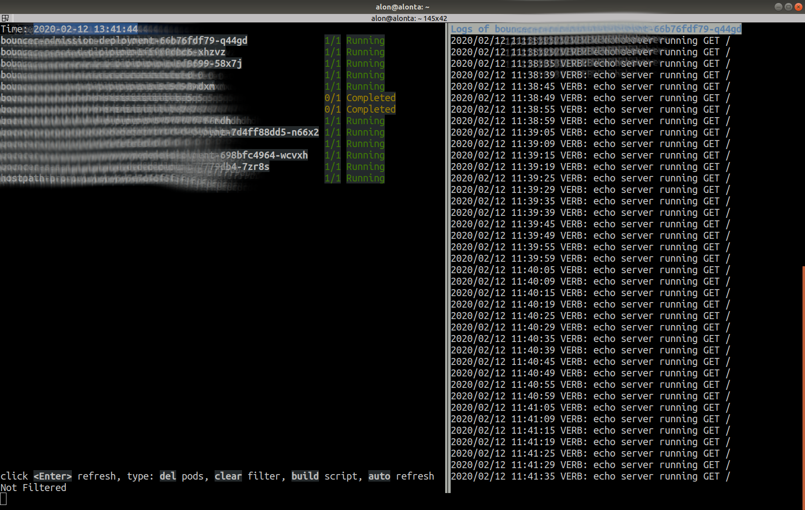

# playkube

This is a nice tool to wrap kubernetes daily operations.

Example of console output:
 

Using this tool you can:
* list running pods
* display logs for a running pod
* automatic and manual refresh of the list
* filter the pods list by expression

For the filtered pods list, you can:
* delete all pods
* run build script, and delete the pods to get updated image running

I have found this tool very useful, hope that you will too...
 